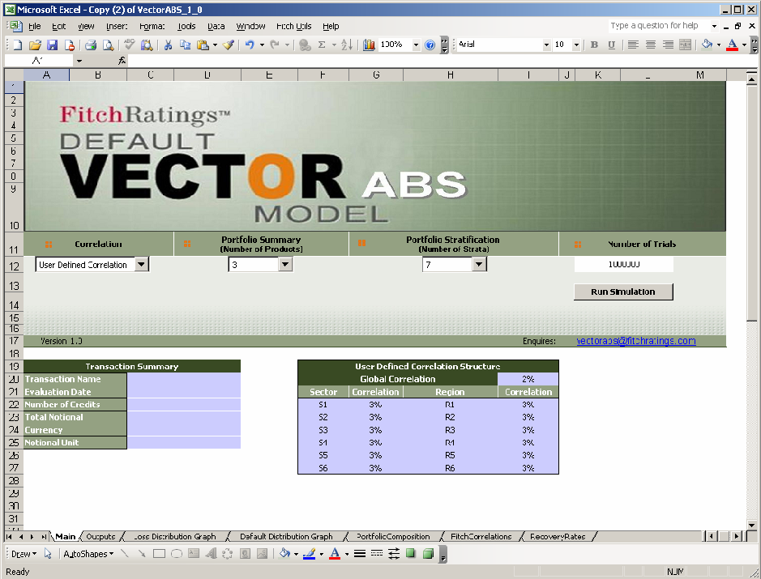

# VECTOR ABS Users Manual

*Converted from PDF on 2025-10-18 12:19:12*
*Total Pages: 19*

---

## Page 1

<!-- Page Metadata: Tables=0, Images=1, TextBlocks=10, Dimensions=595.00x842.00 -->

www.fitchratings.com

### FITCH DEFAULT VECTOR ABS

### MODEL

### USER MANUAL

Version: 1.0

11 October 2006

Authors:

Vasileios Papatheodorou

Balasubramanian Ramachandran

1 © Copyright Fitch Ratings Ltd 2006

---

## Page 2

<!-- Page Metadata: Tables=0, Images=1, TextBlocks=30, Dimensions=595.00x842.00 -->

www.fitchratings.com

Table of Contents

• Overview.......................................................................................................................3

• Installation Instructions..................................................................................................4

A. System Requirements....................................................................................................4

B. Installation Checklist ....................................................................................................4

C. Downloading the VECTOR ABS Model.......................................................................4

D. Installing the VECTOR ABS Model..............................................................................4

E. Opening the VECTOR ABS Model................................................................................5

F. Uninstalling the VECTOR ABS Model..........................................................................5

• VECTOR ABS Definitions............................................................................................6

A. Transaction Summary Input Terms................................................................................6

B. Portfolio Summary Input Terms.....................................................................................6

C. Notional Bands Input Terms...........................................................................................7

D. VECTOR ABS Output Terms........................................................................................7

• Deal Setup.....................................................................................................................9

A. Initial Setup...................................................................................................................9

B. Portfolio Setup.............................................................................................................11

C. Simulation Run............................................................................................................13

• Analytical Results & Summary Reports.......................................................................14

A. Simulation Summary....................................................................................................14

B. Portfolio Default Distribution.......................................................................................14

C. Portfolio Loss Distribution...........................................................................................15

D. Portfolio Composition..................................................................................................16

• VECTOR ABS Assumptions.......................................................................................17

A. Recovery Rates............................................................................................................17

B. Correlation Adjustments...............................................................................................17

C. Simulation Horizon and Confidence Levels..................................................................17

• Appendix I: VECTOR ABS Methodology...................................................................18

VECTOR ABS 1.0 Model Users Manual Page 2 of 19 © Copyright Fitch Ratings Ltd 2006

---

## Page 3

<!-- Page Metadata: Tables=0, Images=3, TextBlocks=25, Dimensions=595.00x842.00 -->

www.fitchratings.com

Overview

The Fitch Default VECTOR ABS model (VECTOR ABS) is Fitch’s main quantitative tool to

evaluate credit risk in consumer loan and leasing portfolios referenced by Asset Backed

Securities (ABS). Employing a Monte Carlo methodology, VECTOR ABS simulates defaults

through a one step process. The determination of default is formally based on a structural

form methodology, which holds that an asset defaults if the value of its assets falls below the

value of its default threshold. The outputs serve as an input into Fitch’s proprietary ABS cash

flow model.

The main outputs of VECTOR ABS are the rating default rates (RDR), the rating recovery

rates (RRR) and the rating loss rates (RLR) corresponding to each rating level. The model

outputs also include various portfolio statistics as well as the portfolio’s default and loss

distribution. VECTOR ABS is not a cash flow model and does not take into account

structural features such as payment waterfalls or excess spread.

The model engine is a C++ compiled program embedded into a Microsoft Excel spreadsheet

which serves as the user interface and contains both inputs and outputs. The model can be

downloaded from Fitch’s website at www.fitchratings.com. For a detailed discussion of

VECTOR ABS and how it is used in Fitch’s overall analysis see “European Consumer ABS

www.fitchratings.com. Rating Criteria”, dated 11 October 2006, also available at

This manual will begin with instructions for installing VECTOR ABS. It will then define the

various terms used and describe how to populate the input sheet. Subsequently it will

describe the various outputs of the model. Next it will discuss the various assumptions made

while evaluating the model. Finally, details about the underlying methodology are covered in

the appendix.

VECTOR ABS 1.0 Model Users Manual Page 3 of 19 © Copyright Fitch Ratings Ltd 2006

---

## Page 4

<!-- Page Metadata: Tables=0, Images=3, TextBlocks=30, Dimensions=595.00x842.00 -->

www.fitchratings.com

Installation Instructions

A. System Requirements

### PC

(cid:132) 512+ MB Memory

(cid:132) 1.2+ GHz Processor Speed

(cid:132) Operating System

(cid:132) Windows NT, 2000, or XP

(cid:132) Software

(cid:132) WinZip

(cid:132) Excel 2003 (Older versions of Excel have not been tested)

B. Installation Checklist

Before installing and or downloading the VECTOR ABS Model you must:

(cid:132) Close all open programs.

(cid:132) Meet the minimum requirements to access and install the model.

C. Downloading the VECTOR ABS Model

Before you can download and install the VECTOR ABS Model you must have access to the

Internet. To download the VECTOR ABS Model:

1. Open your Internet browser.

2. Type www.fitchratings.com in the address field. The Fitch Ratings website appears.

3. Click the Structured Finance menu. A drop-down menu appears. Click on the VECTOR

ABS item in the menu.

D. Installing the VECTOR ABS Model

Once you have downloaded the VECTOR ABS Model file you must install the application.

To install the VECTOR ABS Model:

1. Double click on the downloaded file.

2. The installation script will install the model files in the directory “C:\Fitch\VECTOR

ABS” by default. The installation script will also install the VECTOR ABS icon on

the workspace of the user’s computer.

VECTOR ABS 1.0 Model Users Manual Page 4 of 19 © Copyright Fitch Ratings Ltd 2006

---

## Page 5

<!-- Page Metadata: Tables=0, Images=1, TextBlocks=12, Dimensions=595.00x842.00 -->

www.fitchratings.com

E. Opening the VECTOR ABS Model

1. Go to the Windows “Start” menu and select “Programs”

2. VECTOR ABS should appear as one of the choices. Select the “VECTOR ABS”

option.

3. Alternatively, click on the VECTOR ABS icon on your computer’s screen.

F. Uninstalling the VECTOR ABS Model

1. Go to the Windows “Start” menu and select “Programs”

2. VECTOR ABS should appear as one of the choices. Select the “VECTOR ABS”

option.

3. Select the “Uninstall” option. This will uninstall the software.

VECTOR ABS 1.0 Model Users Manual Page 5 of 19 © Copyright Fitch Ratings Ltd 2006

---

## Page 6

<!-- Page Metadata: Tables=0, Images=3, TextBlocks=30, Dimensions=595.00x842.00 -->

www.fitchratings.com

VECTOR ABS Definitions

### This section provides brief definitions of many key terms used and seen in the VECTOR

ABS model.

A. Transaction Summary Input Terms

Transaction Name – The name of the transaction.

Evaluation Date – The closing date for new transactions or the date of evaluation for

outstanding deals.

Number Of Credits – The number of credits in the underlying portfolio.

Total Notional – The total notional value of the portfolio.

Currency – The currency of the notional amounts used by the model. The user can select the

currency from a drop down menu. The menu includes the currencies EURO and GBP.

Notional Unit – It is the unit of the notional amounts. The user can select the notional

amounts either to be displayed as the actual amounts, thousands or millions.

B. Portfolio Summary Input Terms

Product – The portfolio is assumed to be segmented into products. Each product is assumed

to be homogeneous with respect to its risk profile. It has a uniquely assigned probability of

default, recovery rate and remaining term.

Product ID – A unique integer number which is set automatically by the model. Each

product has a unique Product ID.

Outstanding Principal – The total outstanding amount corresponding to each product.

Probability of Default – The base case default probability of the assets in a specific product.

It is assumed that all the assets in the same product have the same probability of default (PD).

The time horizon for the PD is assumed to be the “maximum remaining term” of the product.

(Please see below for a definition of “maximum remaining term”)

Recovery Rate – The base case recovery assumption of the loans in a specific product. It is

assumed that all the loans in the same product have the same recovery rate.

### Maximum Remaining Term – The maximum remaining term of the credits in a particular

product. It is specified in months and we assume that the remaining term lies between 1 and

VECTOR ABS 1.0 Model Users Manual Page 6 of 19 © Copyright Fitch Ratings Ltd 2006

---

## Page 7

<!-- Page Metadata: Tables=0, Images=1, TextBlocks=33, Dimensions=595.00x842.00 -->

www.fitchratings.com

120 months. The maximum remaining term that is used should not be larger than the term for

which the base case default probability has been set.

Sector – A sector is a risk bucket in the sense that credits within a sector, have an increased

likelihood of defaulting simultaneously. Each product is uniquely mapped to a sector. Fitch

### provides a set of predefined sectors as part of its correlation structure. Fitch has defined the

following 6 sectors:

- Auto Leases (new)

- Auto Leases (used)

- Auto Loans (new)

- Auto Loans (used)

- Consumer Loans (unsec)

- Other Leases

However the user can also define his or her own set of sectors and map the products to these.

Region – It is the geographical region in which the specific product of the portfolio was

### originated. In the Fitch correlation structure the regions are mapped to countries. As part of

the correlation structure Fitch currently specifies 8 European countries. It is also possible for

the user specify a different set of regions. Regions are also considered to be risk buckets in

the same way as sectors.

C. Notional Bands Input Terms

Notional Bands tables describe the distribution of the assets of a portfolio in terms of their

outstanding amount.

Band ID – A unique integer number which is set automatically by the model for each band.

Band Minimum – The minimum outstanding amount that a credit in this band can have.

Band Maximum – The maximum outstanding amount that a credit in this band can have.

Average (AVG) Outstanding Balance – The average outstanding principal of credits in a

band.

D. VECTOR ABS Output Terms

### Rating Default Rate (RDR) – The RDR shows the expected default rate for a particular

credit portfolio in the respective rating scenario on a post-simulation basis. The RDR is

derived from the portfolio default distribution, and it serves as an input into Fitch’s

proprietary ABS cash flow model.

VECTOR ABS 1.0 Model Users Manual Page 7 of 19 © Copyright Fitch Ratings Ltd 2006

---

## Page 8

<!-- Page Metadata: Tables=0, Images=1, TextBlocks=10, Dimensions=595.00x842.00 -->

www.fitchratings.com

Rating Recovery Rate (RRR) – The RRR shows the expected weighted average recovery

### rate for all defaulted assets in a particular portfolio and rating scenario on a post-simulation

basis. It serves as an input into Fitch’s proprietary ABS cash flow model.

### Rating Loss Rate (RLR) – The RLR shows the expected loss rate for a particular credit

portfolio in the respective rating scenario on a post-simulation basis. The RLR takes into

account the stressed recovery rate assumption for each defaulted asset. The RLR is gross of

any structural mitigant such as excess spread. In the absence of structural support, the credit

enhancement has to cover the RLR for the respective rating.

VECTOR ABS 1.0 Model Users Manual Page 8 of 19 © Copyright Fitch Ratings Ltd 2006

---

## Page 9

<!-- Page Metadata: Tables=0, Images=4, TextBlocks=17, Dimensions=595.00x842.00 -->

www.fitchratings.com

Deal Setup

A. Initial Setup

The VECTOR ABS Model is embedded in a Microsoft Excel spreadsheet, which provides the

user interface and contains the model inputs and outputs. In order to set up a new deal the

Main worksheet has to be configured. The top half of the main worksheet is reproduced

below in Figure 1. The primary inputs which have to be decided upon before any analysis

are:

1. Correlation Structure (either “Fitch Defined Sectors” or “User Defined Sectors”).

2. The number of products (1 to 16).

3. The number of notional bands (5 to 20).

<!-- Image 1: pos=(72.08,321.44,522.80,664.64) -->

Figure 1: The main input sheet

It is important to decide upon the three inputs above before keying in any other input

information on to the worksheet since any change in the above three inputs will redraw the

worksheet and reinitialize all the input cells to null. All these three inputs are provided as pull

down boxes near the top of the worksheet below the VECTOR ABS logo. Once a choice is

VECTOR ABS 1.0 Model Users Manual Page 9 of 19 © Copyright Fitch Ratings Ltd 2006

---

## Page 10

<!-- Page Metadata: Tables=2, Images=1, TextBlocks=20, Dimensions=595.00x842.00 -->

www.fitchratings.com

made the worksheet is automatically reconfigured to take inputs for the specified number of

products and bands.

There are two choices for correlation:

a. Fitch Defined Correlation: This will create a portfolio-specific asset correlation

matrix based on Fitch’s assumptions. The correlation coefficient for each pair of

assets is based on their Country and Sector. In addition a global correlation is also

imposed on all the assets. For assets that are either in the same region or in the same

sector or both, the respective sector and region premium will be added to the global

base correlation.

<!-- Table 1: pos=(129.86,294.11,481.29,437.38) -->
|  | Fitch Correlation Structure |  |  |  |  |  |  |  |  |  |  |
| --- | --- | --- | --- | --- | --- | --- | --- | --- | --- | --- | --- |
|  | Global Correlation |  |  |  |  |  |  |  |  | 2% |  |
|  | Sector |  |  | Correlation |  |  | Region |  |  | Correlation |  |
|  | Auto Leases (new) |  |  | 3% |  |  | Austria |  |  | 3% |  |
|  | Auto Leases (used) |  |  | 3% |  |  | Belgium |  |  | 3% |  |
|  | Auto Loans (new) |  |  | 3% |  |  | France |  |  | 3% |  |
|  | Auto Loans (used) |  |  | 3% |  |  | Germany |  |  | 3% |  |
|  | Consumer Loans (unsec) |  |  | 4% |  |  | Italy |  |  | 3% |  |
|  | Other Leases |  |  | 3% |  |  | Portugal |  |  | 3% |  |
|  |  |  |  |  |  |  | Spain |  |  | 3% |  |
|  |  |  |  |  |  |  | United Kingdom |  |  | 3% |  |

Figure 2: Fitch correlation structure used by VECTOR ABS.

b. User Defined Correlation: This option allows the user to define its own sectors and

regions and to assign individual correlation assumptions to them. A maximum of six

sector and six regions can be defined. By selecting this option the user can allocate

each asset on the Main worksheet to one of the six user-defined regions and one of the

six user-defined sectors. The global correlation applies universally for all assets. The

names of the sectors (S1 to S6) and regions (R1 to R6) can also be changed for

convenience.

<!-- Table 2: pos=(166.24,627.20,429.12,741.86) -->
|  | User Defined Correlation Structure |  |  |  |  |  |  |  |  |  |  |
| --- | --- | --- | --- | --- | --- | --- | --- | --- | --- | --- | --- |
|  | Global Correlation |  |  |  |  |  |  |  |  | 2% |  |
|  | Sector |  |  | Correlation |  |  | Region |  |  | Correlation |  |
|  | S1 |  |  | 3% |  |  | R1 |  |  | 3% |  |
|  | S2 |  |  | 3% |  |  | R2 |  |  | 3% |  |
|  | S3 |  |  | 3% |  |  | R3 |  |  | 3% |  |
|  | S4 |  |  | 3% |  |  | R4 |  |  | 3% |  |
|  | S5 |  |  | 3% |  |  | R5 |  |  | 3% |  |
|  | S6 |  |  | 3% |  |  | R6 |  |  | 3% |  |

Figure 3: User defined correlation structure.

VECTOR ABS 1.0 Model Users Manual Page 10 of 19 © Copyright Fitch Ratings Ltd 2006

---

## Page 11

<!-- Page Metadata: Tables=1, Images=1, TextBlocks=27, Dimensions=595.00x842.00 -->

www.fitchratings.com

The number of products can vary between 1 and 16. Each product should consist of assets

which have identical risk profiles. However the assets in a product can have a spread of

notional values. It is recommended to use all the information available to segment the

portfolio into as many products as possible (up to a maximum of 16).

The number of bands depends upon the distribution of notional values. If the notionals have a

unimodal distribution with a small variance then fewer bands are necessary. It is

recommended to define at least 10 bands. The top bands should be used to describe assets

that are much larger than average (e.g. the top 5 obligors in the most upper band).

Once the number of products, the number of bands and the correlation structure have been

defined the input tables are automatically configured. The input cells which require inputs are

colour coded (light purple).

B. Portfolio Setup

The portfolio must be input in four steps:

a. Manually enter the fields of the Transaction Summary table that describe the

transaction. This table is reproduced below and the only elements which are strictly

required are the number of credits and the total notional. A validation step confirms

whether these numbers match with the portfolio stratification information.

<!-- Table 1: pos=(182.84,457.28,412.40,543.20) -->
| Transaction Summary |  |
| --- | --- |
| Transaction Name | Test Portfolio |
| Evaluation Date | 4/10/06 |
| Number of Credits | 60000 |
| Total Notional | 243,820,000.00 |
| Currency | EURO |
| Notional Unit | Actuals |

Table 1: Transaction Summary table

b. Manually enter the fields of the Portfolio Summary table that describe the portfolio in

### product level. Please refer to the Definitions section for a description of the field. The

table is displayed below with sample inputs. None of the columns should be left null.

The values for the region and sector fields are automatically configured to be pull-

down menus with the values restricted to those consistent with the correlation model

chosen. The numbers in the number of credits column must add up to the total number

of credits specified in the transaction summary table.

VECTOR ABS 1.0 Model Users Manual Page 11 of 19 © Copyright Fitch Ratings Ltd 2006

---

## Page 12

<!-- Page Metadata: Tables=4, Images=1, TextBlocks=23, Dimensions=595.00x842.00 -->

www.fitchratings.com

<!-- Table 1: pos=(71.84,113.96,537.28,202.88) -->
| Product Id | Product Name | Number of
Credits | Outstanding
Principal | Probability of
Default | Recovery
Rate | Maximum
Remaining
Term | Sector | Region |
| --- | --- | --- | --- | --- | --- | --- | --- | --- |
| 1
2
3 | new cars 10000 40,490,000.00 2.30% 30.00% 60Auto Leases (new) Italy
used cars 30000 122,000,000.00 2.30% 30.00% 60Auto Leases (used) Italy
other loans 20000 81,330,000.00 2.30% 30.00% 60Consumer Loans (unsec) Italy |  |  |  |  |  |  |  |
| Totals 60000 243,820,000.00 |  |  |  |  |  |  |  |  |

Table 2 : The Portfolio Summary table

c. Manually enter the fields of the Notional Bands table that specify the minimum and

the maximum of each band. This table is reproduced below. This information will

automatically be copied to the band tables of the entire portfolio as well as of all

products. The bands can be chosen to fit the notional distribution in the portfolio. The

bands can vary in width and it is not necessary for the bands to be contiguous but they

must be monotonically increasing. In general 10 bands should be more than adequate

to describe the notional distribution. However there might be a few credits in the

portfolio with large notional values. Separate bands can be allocated for such credits.

<!-- Table 2: pos=(221.12,378.56,373.76,503.12) -->
| Band Id | Band
Minimum | Band
Maximum |
| --- | --- | --- |
| 1 | 0.00 | 2,000.00 |
| 2 | 2,000.00 | 3,000.00 |
| 3 | 3,000.00 | 4,000.00 |
| 4 | 4,000.00 | 5,000.00 |
| 5 | 5,000.00 | 6,000.00 |
| 6 | 6,000.00 | 7,000.00 |
| 7 | 7,000.00 | 8,000.00 |

<!-- Table 3: pos=(273.20,394.40,315.44,413.87) -->
| Band |
| --- |
| Minimum |

<!-- Table 4: pos=(326.24,394.40,368.48,413.87) -->
| Band |
| --- |
| Maximum |

Table 3 : The Notional Band Definitions table

d. Manually enter the fields AVG Outstanding Balance and Number of Credits in the

band tables of the entire portfolio as well as of all products. A sample product table is

reproduced below. Only the last two columns have to be populated. The remaining

columns are automatically populated. The number of credits in each product and band

must be an integer and the average outstanding principal must lie between the

minimum and maximum band limits. If there are no credits in a band then the number

of credits can either be left blank or populated with a zero. The first band table is

reserved for the entire portfolio. This table is retained only for data validation and

guards against input errors. While it is possible to calculate the values for the entire

portfolio from the individual band tables, it is recommended that the user

independently populates this table.

VECTOR ABS 1.0 Model Users Manual Page 12 of 19 © Copyright Fitch Ratings Ltd 2006

---

## Page 13

<!-- Page Metadata: Tables=6, Images=1, TextBlocks=22, Dimensions=595.00x842.00 -->

www.fitchratings.com

<!-- Table 1: pos=(130.16,113.36,464.48,235.04) -->
| Band Id | Product
Name | Band
Minimum | Band
Maximum | AVG
Outstanding
Balance | Number
of Credits |
| --- | --- | --- | --- | --- | --- |
| 1 | new cars | 0.00 | 2,000.00 | 1,000.00 | 1340 |
| 2 | new cars | 2,000.00 | 3,000.00 | 2,500.00 | 1500 |
| 3 | new cars | 3,000.00 | 4,000.00 | 3,500.00 | 1660 |
| 4 | new cars | 4,000.00 | 5,000.00 | 4,500.00 | 2400 |
| 5 | new cars | 5,000.00 | 6,000.00 | 5,500.00 | 1680 |
| 6 | new cars | 6,000.00 | 7,000.00 | 6,500.00 | 1100 |
| 7 | new cars | 7,000.00 | 8,000.00 | 7,500.00 | 320 |

<!-- Table 2: pos=(357.68,116.96,407.36,145.76) -->
| AVG |
| --- |
| Outstanding |
| Balance |

<!-- Table 3: pos=(182.24,126.40,230.48,145.76) -->
| Product |
| --- |
| Name |

<!-- Table 4: pos=(241.28,126.40,278.72,145.76) -->
| Band |
| --- |
| Minimum |

<!-- Table 5: pos=(289.52,126.40,346.64,145.76) -->
| Band |
| --- |
| Maximum |

<!-- Table 6: pos=(417.92,126.40,459.20,145.76) -->
| Number |
| --- |
| of Credits |

Table 4 The product band table

C. Simulation Run

On the Main page the user is allowed to specify the number of scenarios used in the Monte-

Carlo simulation. Generally, the higher the number of simulations, the more accurate the

results will be. The minimum number of trials depends on, among other things, portfolio size,

rating distribution within the portfolio, and the desired percentile on the output side (the

higher the percentile, the higher the minimum number of simulations required). Fitch

recommends running a minimum 1,000,000 trials for an approximation of the RDR/RLR.

After having specified the number of trials, select the Run Simulation button. The simulation

includes a visual timer that will display the progress of the simulation. Note: During the

simulation it will not be possible to amend inputs in any Excel application running. The time

to complete the simulation will depend on, among others, the number of simulation runs, the

simulation horizon, and the number of assets in the portfolio and computer hardware. As a

guide, for a portfolio of 60,000 assets and 1,000,000 simulation runs, 4 products, the

simulation takes between 5 and 6 seconds. Simulation speed can be improved by:

a. Shutting down all other applications.

b. Running the model on a stand alone work station.

c. Using a computer with a 2GHz processor or higher.

Once the simulation is complete, the application will automatically populate the output sheets

and take the user to Simulation output Summary page.

VECTOR ABS 1.0 Model Users Manual Page 13 of 19 © Copyright Fitch Ratings Ltd 2006

---

## Page 14

<!-- Page Metadata: Tables=1, Images=3, TextBlocks=15, Dimensions=595.00x842.00 -->

www.fitchratings.com

Analytical Results & Summary Reports

A. Simulation Summary

The Outputs page reproduces the details about the simulation in a table called the “Portfolio

Properties”. The main outputs of the model which are the rating default rate (RDR), the rating

recovery rate (RRR) and the rating loss rate (RLR) are listed in a separate table (reproduced

below). The table shows the RDR, RRR and RLR for each rating scenario. The RDR, RLR

and RRR are derived as the percentile of the respective distribution, corresponding to the

default rate implied by the rating scenario and term.

<!-- Table 1: pos=(71.46,294.97,487.05,502.84) -->
| Rating |  |  |  | Rating Default |  | Rating Recovery Rate |  |  | Rating Loss Rate |  |  |
| --- | --- | --- | --- | --- | --- | --- | --- | --- | --- | --- | --- |
|  |  |  |  | Rate |  |  |  |  |  |  |  |
|  |  |  |  | (RDR) |  |  | (RRR) |  |  | (RLR) |  |
| AAA |  |  | 15.88% |  |  | 15.87% |  |  | 13.36% |  |  |
| AA+ |  |  | 15.44% |  |  | 17.30% |  |  | 12.77% |  |  |
| AA |  |  | 14.21% |  |  | 18.69% |  |  | 11.56% |  |  |
| AA- |  |  | 13.20% |  |  | 19.59% |  |  | 10.61% |  |  |
| A+ |  |  | 12.26% |  |  | 20.51% |  |  | 9.74% |  |  |
| A |  |  | 10.97% |  |  | 21.41% |  |  | 8.62% |  |  |
| A- |  |  | 9.13% |  |  | 22.28% |  |  | 7.10% |  |  |
| BBB+ |  |  | 7.94% |  |  | 23.20% |  |  | 6.09% |  |  |
| BBB |  |  | 7.11% |  |  | 24.14% |  |  | 5.39% |  |  |
| BBB- |  |  | 6.47% |  |  | 25.10% |  |  | 4.84% |  |  |
| BB+ |  |  | 5.95% |  |  | 26.06% |  |  | 4.40% |  |  |
| BB |  |  | 5.50% |  |  | 27.03% |  |  | 4.01% |  |  |
| BB- |  |  | 5.11% |  |  | 27.91% |  |  | 3.68% |  |  |

B. Portfolio Default Distribution

The portfolio default distribution is displayed in the “Default Distribution Graph” page and

### shows the frequency of a particular portfolio default rate in a simulation. As the actual

distribution may be too large for some portfolios, the model separates the results into a

number of bins. Figure 4 gives an example of such a graph.

VECTOR ABS 1.0 Model Users Manual Page 14 of 19 © Copyright Fitch Ratings Ltd 2006

---

## Page 15

<!-- Page Metadata: Tables=0, Images=1, TextBlocks=19, Dimensions=595.00x842.00 -->

www.fitchratings.com

Default Distribution (RDR)

0.030%

0.025%

0.020% ytisneD

0.015%

ytilibaborP

0.010%

0.005%

0.000%

%40.0 %47.0 %44.1 %41.2 %48.2 %45.3 %42.4 %49.4 %46.5 %43.6 %40.7 %47.7 %44.8 %41.9 %48.9 %45.01 %42.11 %49.11 %46.21 %43.31 %40.41 %47.41 %44.51

Loss Amount (% of total)

Figure 4: Default distribution graph produced by VECTOR ABS.

C. Portfolio Loss Distribution

The portfolio loss distribution is displayed in the “Los Distribution Graph page” and shows

### the frequency of a particular portfolio loss rate in a simulation. The shape of graph is almost

identical to the Default distribution as it is only the loss amount that gets adjusted due to

recovery.

VECTOR ABS 1.0 Model Users Manual Page 15 of 19 © Copyright Fitch Ratings Ltd 2006

---

## Page 16

<!-- Page Metadata: Tables=1, Images=1, TextBlocks=19, Dimensions=595.00x842.00 -->

www.fitchratings.com

D. Portfolio Composition

The Portfolio Composition graphs show the portfolio composition by product, region and

sector. A sample graph showing the product segmentation is displayed below.

Portfolio Composition by Product

45000

<!-- Table 1: pos=(133.04,257.60,513.68,406.88) -->
40000

35000

tnuoC 30000

25000

rebmuN 20000

15000

10000

5000

0

new cars used cars other loans personal loans

Product

Figure 5: Portfolio distribution by product graph produced by VECTOR ABS.

VECTOR ABS 1.0 Model Users Manual Page 16 of 19 © Copyright Fitch Ratings Ltd 2006

---

## Page 17

<!-- Page Metadata: Tables=1, Images=3, TextBlocks=17, Dimensions=595.00x842.00 -->

www.fitchratings.com

VECTOR ABS Assumptions

A. Recovery Rates

This table contains Fitch’s Scaling levels applied to the base case recovery rate assumption,

listed in tabular format and organised by Country and Asset Sector. The higher the rating

### stress, the lower the scaling. We reproduce part of the table below.

<!-- Table 1: pos=(71.65,255.44,536.67,369.09) -->
| Sector |  |  | AAA | AA+ | AA | AA- | A+ |
| --- | --- | --- | --- | --- | --- | --- | --- |
| Auto Leases (new) |  |  | 60.00% | 65.00% | 70.00% | 73.33% | 76.66% |
| Auto Leases (used) |  |  | 60.00% | 65.00% | 70.00% | 73.33% | 76.66% |
| Auto Loans (new) |  |  | 60.00% | 65.00% | 70.00% | 73.33% | 76.66% |
| Auto Loans (used) |  |  | 60.00% | 65.00% | 70.00% | 73.33% | 76.66% |
| Consumer Loans (unsec) |  |  | 50.00% | 55.00% | 60.00% | 63.33% | 66.66% |
|  | Other Leases |  | 50.00% | 55.00% | 60.00% | 63.33% | 66.66% |

Table 5 : Recovery Rate Scaling table.

B. Correlation Adjustments

### As part of Fitch’s criteria, adjustments are made to the correlation based on Region, Country

and Industry. The actual correlation table is displayed in Figure 2.

C. Simulation Horizon and Confidence Levels

The simulation horizon is the maximum of the remaining terms of the assets in the portfolio.

The maximum remaining term that is used should not be larger than the term for which the

base case default probability has been set. The confidence levels are then calculated for that

horizon. If the maximum remaining terms applicable to the various products in the portfolio

vary significantly, Fitch will model the sub-portfolios individually.

VECTOR ABS 1.0 Model Users Manual Page 17 of 19 © Copyright Fitch Ratings Ltd 2006

---

## Page 18

<!-- Page Metadata: Tables=5, Images=3, TextBlocks=40, Dimensions=595.00x842.00 -->

www.fitchratings.com

Appendix I: VECTOR ABS Methodology

The general framework of VECTOR ABS is common to nearly all credit risk portfolio

models – a multi risk factor, Monte Carlo model which generates the distribution of the

portfolio losses by simulating various scenarios. VECTOR ABS provides for a single global

risk factor and a set of regional and sector risk factors. Each of these factors is represented by

a latent random Gaussian variable and is assumed to be independent of the other factors. A

random draw for each of these factors creates a scenario or “state of the world”.

In each scenario, for every asset in the portfolio we compute an asset value. The value of the

### asset variable depends partially on the global, regional and sector risk factors and partially

upon its own idiosyncratic risk factor. To determine whether an asset defaults we compare its

asset value against a threshold which is determined exclusively by the asset’s probability of

default.

If the asset defaults, the outstanding amount of the asset is recorded. The cumulative default

of the scenario is then the sum of the amounts outstanding of the defaulted assets. In addition,

for each defaulted asset the model records the recovered amount from which the average

recovery rate and ultimately the cumulative loss amount are calculated. Running a large

number of simulations then leads to a distribution of the results with regards to cumulative

defaults, the weighted average recovery rates and cumulative losses, from which the RDR,

RRR, and RLR are derived.

Recent work has shown that the correlation structure described under a Gaussian copula

model lacks a way to enhance the correlation in stressed scenarios as is observed in the real

world. VECTOR ABS remedies this by introducing a global factor with scenario dependent

correlation. The global factor is a risk factor that affects each and every asset in the portfolio

and the correlation induced by this factor depends on the scenario chosen. Thus it is possible

in the model to emphasize the correlation for stressed scenarios.

The following example shows how the portfolio default distribution is generated in the

VECTOR ABS model. For the purpose of illustration, we assume the hypothetical portfolio

comprises only three loans that are modelled in six independent simulation runs. For each, the

model computes the total defaulted asset notional.

Table 6: Portfolio inputs

Product Sector #Credits Notional PD RR Region

<!-- Table 1: pos=(71.21,603.68,504.08,612.80) -->
|  | New cars |  |  | Autos Loans (new) |  |  | 2 |  |  | 8,300 |  |  | 3.5% |  |  | 35% |  |  | Italy |  |
| --- | --- | --- | --- | --- | --- | --- | --- | --- | --- | --- | --- | --- | --- | --- | --- | --- | --- | --- | --- | --- |

Cons. Loans Consumer Loans 1 7,000 3.8% 40% Italy

Table 7 : Simulation results.

Simulation 1 Simulation 2 Simulation 3 Simulation 4 Simulation 5 Simulation 6

<!-- Table 2: pos=(71.21,656.48,523.31,665.84) -->
|  | Loan 1 |  | 1 |  |  | 1 |  |  |  |  |  |  |  |  | 1 |  | 1 |  |
| --- | --- | --- | --- | --- | --- | --- | --- | --- | --- | --- | --- | --- | --- | --- | --- | --- | --- | --- |

Loan 2 1 1 1

<!-- Table 3: pos=(71.21,674.96,523.31,684.08) -->
|  | Loan 3 |  |  |  |  |  |  |  | 1 |  |  |  |  |  | 1 |  | 1 |  |
| --- | --- | --- | --- | --- | --- | --- | --- | --- | --- | --- | --- | --- | --- | --- | --- | --- | --- | --- |

Default Simulation 1 Simulation 2 Simulation 3 Simulation 4 Simulation 5 Simulation 6

<!-- Table 4: pos=(71.21,702.56,523.31,711.68) -->
|  | Loan 1 |  | 5,000 |  |  | 5,000 |  |  | 0 |  |  | 0 |  |  | 5,000 |  | 5,000 |  |
| --- | --- | --- | --- | --- | --- | --- | --- | --- | --- | --- | --- | --- | --- | --- | --- | --- | --- | --- |

Loan 2 0 0 3,300 3,300 0 3,300

<!-- Table 5: pos=(71.21,721.04,523.31,730.16) -->
|  | Loan 3 |  | 0 |  |  | 0 |  |  | 7,000 |  |  | 0 |  |  | 7,000 |  | 7,000 |  |
| --- | --- | --- | --- | --- | --- | --- | --- | --- | --- | --- | --- | --- | --- | --- | --- | --- | --- | --- |

Default Rate 5,000 5,000 10,300 3,300 12,000 15,300

VECTOR ABS 1.0 Model Users Manual Page 18 of 19 © Copyright Fitch Ratings Ltd 2006

---

## Page 19

<!-- Page Metadata: Tables=1, Images=1, TextBlocks=14, Dimensions=595.00x842.00 -->

www.fitchratings.com

The results of all the simulation paths are then sorted according to the portfolio default

### amount and the occurrence of each value is counted. In this particular example, path one and

two yield the same results.

Table 8: Default distribution.

Default #

<!-- Table 1: pos=(156.56,162.56,428.48,208.40) -->
|  | Simulation 4 |  |  | 3,300 |  |  | 1 |  |
| --- | --- | --- | --- | --- | --- | --- | --- | --- |
|  |  |  | 5,000 |  |  |  |  |  |
|  | Simulation 3 |  |  | 10,300 |  |  | 1 |  |
|  |  |  | 12,000 |  |  |  |  |  |
|  | Simulation 6 |  |  | 15,300 |  |  | 1 |  |

The absolute portfolio default amounts are expressed as a percentage of the initial portfolio

amount to yield the portfolio default rates. The frequency of defaults is expressed as a

percentage of the simulations run. The resulting frequency distribution of losses is called the

default distribution (RDR). Adjusting the losses for recovery rates results in the loss

distribution or the RLR distribution.

A more mathematical discussion of the VECTOR ABS methodology is given in “European

Consumer ABS Rating Criteria”, dated 11 October 2006, available on www.fitchratings.com.

VECTOR ABS 1.0 Model Users Manual Page 19 of 19 © Copyright Fitch Ratings Ltd 2006

---
